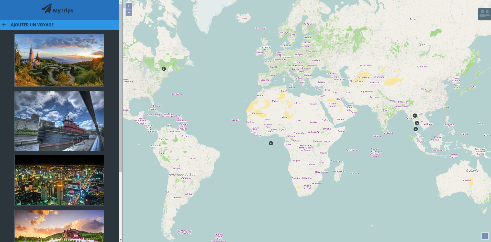
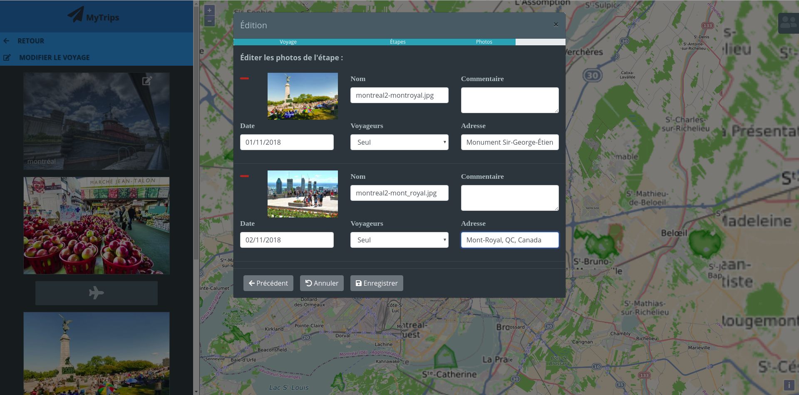
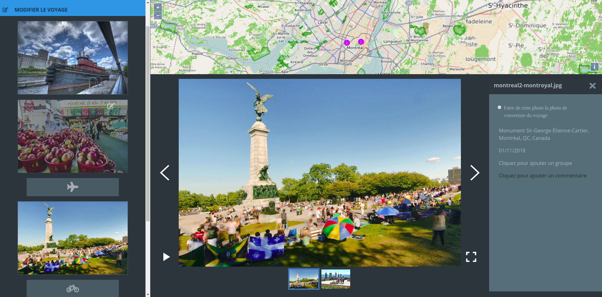

# MyTrips front-end

Une application responsive pour géolocaliser et gérer ses photos de voyage, utilisant les méta données et permettant 
d'y associer des informations supplémentaires (organisation par voyage et "étapes", moyens de transport entres les étapes,
commentaires, dates, amis présents..).

## Prérequis

- Git [home](git-home) (téléchargement, documentation) plus d'informations sur git [ici](git-github).

- [NodeJs](https://nodejs.org/en/)

- [MyTrips backend](git clone https://github.com/rivaultn/mytrips_api_backend.git)

- Pour utiliser l'application il est nécessaire de posséder une clé d'authentification personnelle google maps.
Plus d'informations [ici](https://developers.google.com/maps/documentation/javascript/get-api-key)

## Installation
### 1. Récupérer le code

Via Git, en clonant ce dépôt (`git clone https://github.com/rivaultn/mytrips_frontend.git`)

### 2. Installer les dépendances

- Installer les dépendances (`npm install`).

### 3. Modifier le fichier de constante global

Modifier le fichier `.constant.js` à la racine du dossier `app`

### 4. Exécuter le projet

- Exécuter le projet (`npm start`).

# Build with

* [ReactJs](https://github.com/facebook/react)
* [Redux](https://github.com/reduxjs/redux)
* [React-boilerplate](https://github.com/react-boilerplate/react-boilerplate)
* [Reactstrap](https://github.com/reactstrap/reactstrap)
* [NodeJs](https://nodejs.org/en/)

* Et bien d'autres paquets NPM et librairie

## Authors

* **Nicolas Rivault** - [rivaultn](https://github.com/rivaultn)
